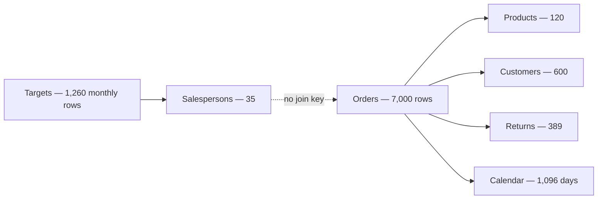

# TrendKart Retail Analytics Dashboard

## Project overview

TrendKart Retail Analytics is an interactive Power BI dashboard built on two years (Jan 2024 – Dec 2025) of retail transaction data, covering sales, orders, customers, products, categories, returns, and shipping costs across four regions of India.

The dashboard turns raw transactional data into business-focused insights that support decisions on product assortment, customer retention, regional performance, revenue growth, and operational efficiency — from headline KPIs down to category, product, and return-driver level.

> **About the dataset**
> This project uses TrendKart's synthetic "Power BI Training" dataset (Orders, Products, Customers, Returns, Calendar). It was intentionally built with real-world data-quality issues — duplicate rows, inconsistent text casing, and values stored as text — as an ETL/cleaning exercise. All figures below are computed from the cleaned data (see [Data cleaning & quality notes](#data-cleaning--quality-notes)). Per the dataset's own documentation, this is **classroom/training data, not real market data**.

## Business objectives

The dashboard answers the following questions:

1. How much revenue is being generated, and how is it changing over time?
2. Which product categories and products contribute most to sales?
3. Which regions and cities perform best?
4. What is the average order value?
5. How many unique customers and products are represented?
6. What is the return rate, and which products or categories drive returns?
7. How significant are shipping costs relative to sales?
8. Where are the largest opportunities for growth or operational improvement?

## Key performance indicators

All figures are based on **6,665 delivered orders** (Jan 2024 – Dec 2025), after removing 30 duplicate order rows and excluding 335 cancelled orders (4.79% cancellation rate) from revenue and volume metrics.

| KPI | Value | Definition |
|---|---:|---|
| Total sales | **₹3,49,88,953** (₹34,988,953) | Sum of `Sales Amount` (`Quantity × Unit Price × (1 − Discount)`) on delivered orders |
| Total orders | **6,665** | Delivered orders (7,000 unique orders placed; 335 cancelled) |
| Total quantity sold | **12,367 units** | Sum of `Quantity` on delivered orders |
| Average order value | **₹5,249.66** | Total sales ÷ total orders |
| Unique customers | **600 / 600 (100%)** | Every customer in the master list placed at least one order |
| Distinct products sold | **120 / 120 (100%)** | Every product in the catalog sold at least once |
| Returned orders | **389** | Distinct orders with a matching return record |
| Return rate | **5.84%** | Returned orders ÷ delivered orders |
| Shipping cost recorded | **₹65,808** | Sum of `Shipping Cost` — ⚠️ present on only 45.2% of delivered rows (see caveats) |
| Top category | **Electronics** — ₹1,86,84,637 (53.4% of sales) | Category with the highest sales |
| Top product | **Voltix Ultra 5G Smartphone** — ₹26,09,713 | Product with the highest sales |
| Top region | **South** — ₹1,03,56,627 (29.6%) | Narrowly ahead of North (29.5%) |

## Key insights

### Sales performance

- Total sales reached **₹3.50 Crore** across **6,665 delivered orders** over the two-year window.
- Sales grew from **₹1.59 Crore in 2024** to **₹1.91 Crore in 2025** — **+20.6% year-over-year**.
- The strongest month was **November 2025** (₹23.98 Lakh); the weakest was **April 2024** (₹9.36 Lakh).
- Both years show a consistent **October–November spike** (festive-season buying), followed by a dip through Q1 of the following year — a seasonal pattern worth planning inventory and marketing spend around.

### Product and category performance

- **Electronics** is the dominant category, contributing **53.4%** of total sales — more than Fashion, Home & Kitchen, Beauty, Sports, and Books combined.
- **Fashion (17.9%)** and **Home & Kitchen (17.7%)** are effectively tied for second place.
- **Books & Stationery** is the smallest category at just **0.7%** of sales — a candidate for assortment review.
- The top-selling product is the **Voltix Ultra 5G Smartphone** (₹26.10 Lakh), and **6 of the top 10 products by revenue are Voltix-brand smartphones** — a notable single-brand concentration within Electronics.
- The top 10 products account for **36.8%** of total sales (top 5 alone: **24.0%**), indicating moderate — not extreme — sales concentration; revenue isn't overly dependent on one SKU.

### Customer and regional performance

- All **600 customers** in the master list placed at least one order, and all **120 products** sold at least once — full catalog and customer-base coverage, so growth here comes from repeat/volume behavior rather than untapped customers or dead stock.
- Average order value of **₹5,249.66** reflects a mix dominated by higher-ticket Electronics purchases.
- **South (29.6%)** and **North (29.5%)** are essentially tied for the top region, with **West (25.0%)** close behind; **East (15.9%)** trails noticeably and is the clearest regional growth opportunity.
- The top 5 cities — Mumbai, Bengaluru, Noida, Chennai, and Kolkata — are tightly clustered between ₹26.2–29.2 Lakh each, showing well-distributed demand rather than one city carrying the business.

### Returns and operational efficiency

- The overall return rate is **5.84%** (389 of 6,665 delivered orders), representing **₹23.18 Lakh** in returned order value (**6.6%** of total sales).
- **Beauty & Personal Care** has the highest category return rate at **6.7%**, followed closely by Home & Kitchen (5.9%) and Electronics (5.85%); **Books & Stationery** has the lowest at **4.6%**.
- The leading return reasons are **"Quality Not As Expected" (29.0% of returns)**, **"Size or Fit Issue" (22.9%)**, and **"Damaged Product" (21.3%)** — together accounting for nearly three-quarters of all returns, pointing to quality control and packaging/fulfillment as the top areas to investigate.
- **UPI is the dominant payment method** (45.0% of orders, 44.3% of sales value), and **85.2% of orders use a digital payment method** rather than cash on delivery — relevant context for return-and-refund processing time.
- Recorded shipping cost totals **₹65,808**, only **0.19%** of sales among the rows where it's populated — but this figure is **not reliable**, since 54.8% of delivered orders have no shipping cost recorded at all (see caveats below).

## Data cleaning & quality notes

The source tables were deliberately built with realistic data-quality issues as an ETL exercise. The following cleaning steps were applied before any KPI was calculated:

| Table | Issue found | Fix applied |
|---|---|---|
| Orders | 30 exact duplicate rows (7,030 → 7,000 unique orders) | Dropped duplicates |
| Orders | `Payment Method` had case variants (`UPI`/`upi`, `Credit Card`/`credit card`) and COD split across two labels (`COD`, `Cash on Delivery`) | Normalized to 5 clean categories |
| Orders | `Sales Amount` doesn't exist as a raw column | Derived as `Quantity × Unit Price × (1 − Discount)` |
| Orders | `Shipping Cost` missing on 54.8% of delivered rows | Left as missing (not imputed) and flagged wherever the metric is reported |
| Orders | 335 orders (4.79%) have `Order Status = Cancelled` | Excluded from revenue/volume KPIs; retained only for cancellation-rate reporting |
| Products | 3 exact duplicate rows (123 → 120 unique products) | Dropped duplicates |
| Products | `Category` had lowercase duplicates of the same 6 categories | Normalized casing |
| Products | `MRP` stored as text with `₹` symbol and comma separators | Stripped formatting, cast to numeric |
| Customers | `Gender` stored as mixed codes (`Male`/`M`, `Female`/`F`) | Standardized to single-letter codes |
| Customers | `City` had leading/trailing whitespace on 45 records | Trimmed |

**Known limitation carried forward:** `Salespersons` (35 people) and `Targets` (1,260 monthly targets) exist as reference tables but have **no `Salesperson ID` column in Orders** to join against — so salesperson-level target attainment cannot currently be calculated. See [Future improvements](#future-improvements).

## Data model



### Main tables

| Table | Rows (cleaned) | Key fields |
|---|---:|---|
| Orders | 7,000 | Order ID, Order Date, Customer ID, Product ID, Quantity, Unit Price, Discount, Shipping Cost, Payment Method, Order Status |
| Products | 120 | Product ID, Product Name, Brand, Category, Sub-Category, MRP |
| Customers | 600 | Customer ID, Customer Name, Gender, City, State, Region |
| Returns | 389 | Return ID, Order ID, Return Date, Return Reason |
| Calendar | 1,096 | Date, Year, Quarter, Month, MonthName, Day, Weekday |
| Salespersons | 35 | SalespersonID, Name, Region, Manager, Experience — not currently linked to Orders |
| Targets | 1,260 | SalespersonID, Year, Month, SalesTarget (35 salespeople × 36 months) |

## Core DAX measures

These are the measures actually defined in the Power BI model (`TrendKart Retail Analysis.pbix`):

```DAX
Total Sales =
SUM(Orders[Sales Amount])
```

```DAX
Total Orders =
COUNTROWS(Orders)
```

```DAX
Total Quantity =
SUM(Orders[Quantity])
```

```DAX
Average Order Value =
SUM(Orders[Sales Amount]) / COUNT(Orders[Order ID])
```

```DAX
Average Selling Price =
SUM(Orders[Sales Amount]) / SUM(Orders[Quantity])
```

```DAX
Unique Customers =
COUNT(Customers[Customer ID])
```

```DAX
Distinct Products =
DISTINCTCOUNT(Orders[Product ID])
```

```DAX
Returned Orders =
COUNT(Returns[Order ID])
```

```DAX
Return Rate =
(COUNTROWS(Returns) / COUNTROWS(Orders)) * 100
```

```DAX
Shipping Cost =
SUM(Orders[Shipping Cost])
```

```DAX
Category Sales % =
DIVIDE(
    SUM(Orders[Sales Amount]),
    CALCULATE(SUM(Orders[Sales Amount]), ALL(Products[Category])),
    0
) * 100
```

## Tools and technologies

- **Microsoft Power BI** for data modeling, DAX measures, interactive visuals, filters, and dashboard design
- **DAX** for business calculations and KPI definitions
- **Power Query** for data preparation and transformation
- **Python (pandas, matplotlib)** for data cleaning validation and the supplementary charts in this README
- **GitHub** for version control and project documentation

## How to use the dashboard

1. Download or clone this repository.
2. Open `TrendKart Retail Analysis.pbix` in Power BI Desktop.
3. If Power BI reports a missing data source, point it to the CSV files (or `TrendKart_Dataset.xlsx`) included in this repository.
4. Refresh the model.
5. Use slicers and filters to explore time periods, products, categories, customers, and regions.
6. Hover over chart elements to view detailed tooltips.
7. Use drill-through or cross-filtering features where available.

## Repository structure

```text
trendkart-retail-analysis/
├── README.md
├── TrendKart_Retail_Analysis.pbix
└── Dataset/
    ├── TrendKart_Orders.csv
    ├── TrendKart_Products.csv
    ├── TrendKart_Customers.csv
    ├── TrendKart_Returns.csv
    ├── TrendKart_Calendar.csv
    ├── TrendKart_Salespersons.csv
    ├── TrendKart_Targets.csv
    └── TrendKart_Dataset.xlsx
```

## Data quality checklist

| Check | Result |
|---|---|
| Order IDs unique | ✅ Fixed — 30 duplicates removed |
| Customer and product keys join correctly | ✅ Verified — 0 orphaned Product IDs or Customer IDs in Orders |
| Dates parsed consistently | ✅ Verified — all Order Dates parse cleanly as `DD-MM-YYYY` |
| Sales amounts and shipping costs numeric | ✅ Sales Amount derived; Shipping Cost numeric where present |
| Missing values documented | ✅ Shipping Cost missing on 54.8% of delivered orders |
| Returned orders matched correctly | ✅ All 389 return records match a delivered order |
| Return rate uses distinct returned orders | ✅ Confirmed no duplicate return rows per order |
| Total sales and order counts reconcile | ✅ 6,665 delivered + 335 cancelled = 7,000 unique orders |

## Limitations

- This is a **synthetic training dataset**, not real market data — insights demonstrate analytical technique, not actual TrendKart business performance.
- **Shipping cost is unreliable as reported**: over half of delivered orders have no value recorded, so the ₹65,808 figure and 0.19%-of-sales ratio should be treated as a lower bound, not a true total.
- **Salesperson-level performance cannot be measured** with the current data model — Orders has no Salesperson ID to join against the Salespersons/Targets tables.
- Return-rate calculations here are by **order count**; a value-weighted or quantity-weighted return rate could tell a different story for high-ticket categories like Electronics.
- Regional and city-level conclusions are based on the customer's registered location, not necessarily the delivery address.

## Future improvements

- Add a `Salesperson ID` (or region-based attribution logic) to Orders so the Salespersons/Targets tables can support target-vs-actual analysis.
- Backfill or otherwise account for the missing 54.8% of Shipping Cost values before using that KPI in decisions.
- Add year-over-year and month-over-month comparison measures directly in the model.
- Add profit and margin analysis using `MRP` as a cost-of-goods proxy.
- Add customer retention, repeat-purchase, and cohort analysis.
- Add product-level return-reason breakdowns (currently only order-level).
- Add a decomposition tree for sales and return-rate drivers.
- Publish to Power BI Service and link the published report here.

## Author

**Sparsh Bhardwaj**
B.Tech CSE (Data Science), Bharati Vidyapeeth's College of Engineering (BVCOE)

This project was created as a retail analytics and business intelligence portfolio project using Microsoft Power BI.

## License

MIT License — this dataset is synthetic training data, so it's freely reusable.
